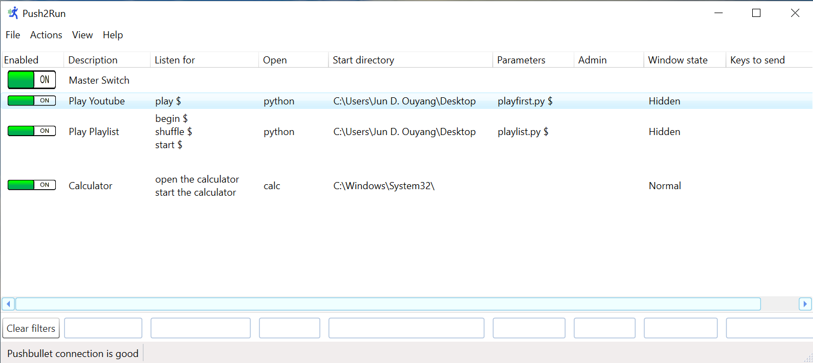

# Push2Youtube
Play first search result (playfirst.py) or playlist (playlist.py)

# How to use
Please follow this guide 
https://beebom.com/how-control-pc-with-google-assistant/
to first learn how to setup IFTTT, Pushbullet and Push2Run.

Alternatively, you may follow this this video on YouTube:
https://www.youtube.com/watch?v=0QOs-phAOj8

Note: you must first have a google account.

1. Place both python files in destination of your choice. I have used "C:\Users\My Name\Desktop" in this example.
2. Set Push2Run Actions. I have set "play" for music playing and "begin"/"shuffle"/"start" to play playlists on YouTube.

